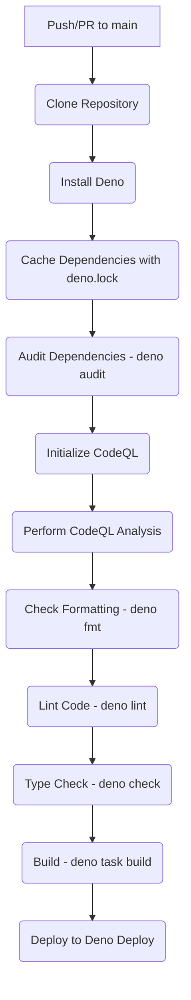

# Plan: Enhancing CI/CD Pipeline Security

**Date:** 2025-05-10

**Goal:** Integrate dependency vulnerability scanning and static application security testing (SAST) into the existing GitHub Actions workflow to improve the overall security posture of the project.

## Phase 1: Dependency Security with `deno audit`

This phase focuses on identifying and managing vulnerabilities in project dependencies.

1.  **Enable Lock File Generation:**
    *   **File to Modify:** `deno.json`
    *   **Action:** Change the line `"lock": false` to `"lock": true`, or remove the line entirely (as `true` is the default behavior if a lock file is intended to be used and `--lock-write` is specified during caching). This ensures that dependency versions are pinned.
    *   **Reasoning:** A `deno.lock` file ensures reproducible builds by locking dependency versions. This allows `deno audit` to accurately check for known vulnerabilities in the specific versions being used.

2.  **Generate/Update and Commit `deno.lock`:**
    *   **Action (Manual, one-time setup):** Execute the following command in your local project terminal. This command should include all relevant entry points and files that import dependencies.
        ```bash
        deno cache --lock=deno.lock --lock-write main.ts routes/**/*.ts routes/**/*.tsx islands/**/*.ts islands/**/*.tsx components/**/*.ts components/**/*.tsx functions/**/*.ts hooks/**/*.ts
        ```
        *(Adjust the file list as necessary for your project structure.)*
    *   **Action (Git):** Commit the newly generated or updated `deno.lock` file to your Git repository.
    *   **Reasoning:** The `deno.lock` file must be version-controlled so the CI pipeline and other developers use the same set of locked dependencies.

3.  **Add `deno audit` to GitHub Workflow:**
    *   **File to Modify:** `.github/workflows/deploy.yml`
    *   **Insertion Point:** After the "Install Deno" step and before "Check code formatting".
    *   **New Workflow Steps:**
        ```yaml
              - name: Cache dependencies
                run: deno cache main.ts --lock=deno.lock # Ensure this uses your main entry point(s)

              - name: Audit dependencies
                run: deno audit --lock=deno.lock
        ```
    *   **Reasoning:** This automates the process of checking dependencies against a vulnerability database on every push and pull request to the main branch.

## Phase 2: Code Security with GitHub CodeQL

This phase focuses on integrating static analysis to find potential security vulnerabilities in the application code. Since the repository is public, GitHub CodeQL is a suitable and free option.

1.  **Enable CodeQL Analysis in GitHub Workflow:**
    *   **File to Modify:** `.github/workflows/deploy.yml`
    *   **Modifications:**
        *   Update the `permissions` block in the workflow to include `security-events: write`. This allows CodeQL to post its findings to the "Security" tab of your GitHub repository.
            ```yaml
            permissions:
              id-token: write # Needed for auth with Deno Deploy
              contents: read # Needed to clone the repository
              security-events: write # Needed for CodeQL to write findings
            ```
        *   Add the CodeQL initialization and analysis steps before the build step.
    *   **New Workflow Steps:**
        ```yaml
              - name: Initialize CodeQL
                uses: github/codeql-action/init@v3
                with:
                  languages: 'javascript-typescript' # Explicitly specify languages
                  # queries: +security-extended # Optional: Uncomment to include more security queries

              # Autobuild (part of CodeQL init/analyze) will attempt to build the code.
              # For Deno/Fresh projects, ensure all relevant source files are accessible.
              # If CodeQL has trouble building, a custom build step for CodeQL might be needed,
              # but the default behavior for JavaScript/TypeScript is often sufficient.

              - name: Perform CodeQL Analysis
                uses: github/codeql-action/analyze@v3
        ```
    *   **Reasoning:** CodeQL performs deep static analysis of the codebase, identifying a wide range of potential security vulnerabilities based on a comprehensive set of queries maintained by GitHub and the community.

## Visualized Workflow Update



## Summary of Changes Required

*   **`deno.json`:**
    *   Update the `lock` setting from `false` to `true` (or remove the line).
*   **Local Development Environment (One-time):**
    *   Run `deno cache --lock=deno.lock --lock-write ...` with appropriate entry points.
    *   Commit `deno.lock`.
*   **`.github/workflows/deploy.yml`:**
    *   Add a step to `deno cache main.ts --lock=deno.lock` (or relevant entry points).
    *   Add a step to run `deno audit --lock=deno.lock`.
    *   Update the `permissions` block to add `security-events: write`.
    *   Add the `github/codeql-action/init@v3` step.
    *   Add the `github/codeql-action/analyze@v3` step.

This plan provides a structured approach to significantly enhance the security checks within your CI/CD pipeline.